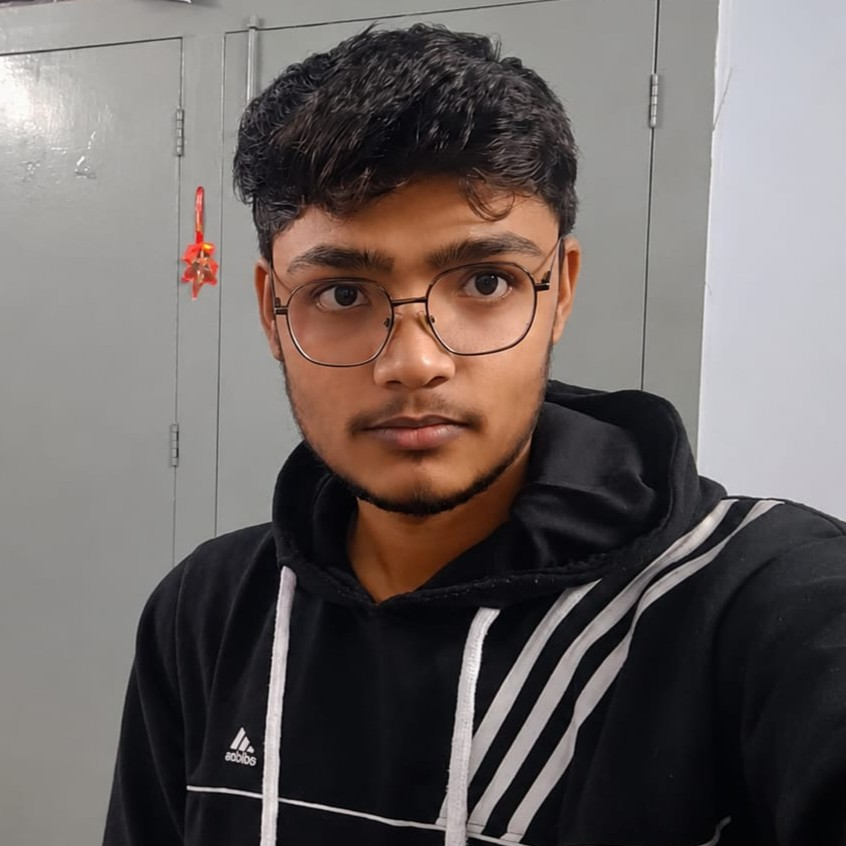
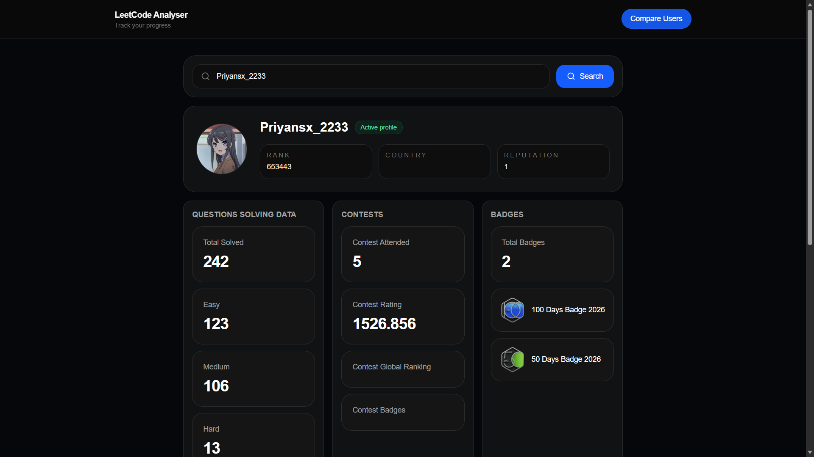
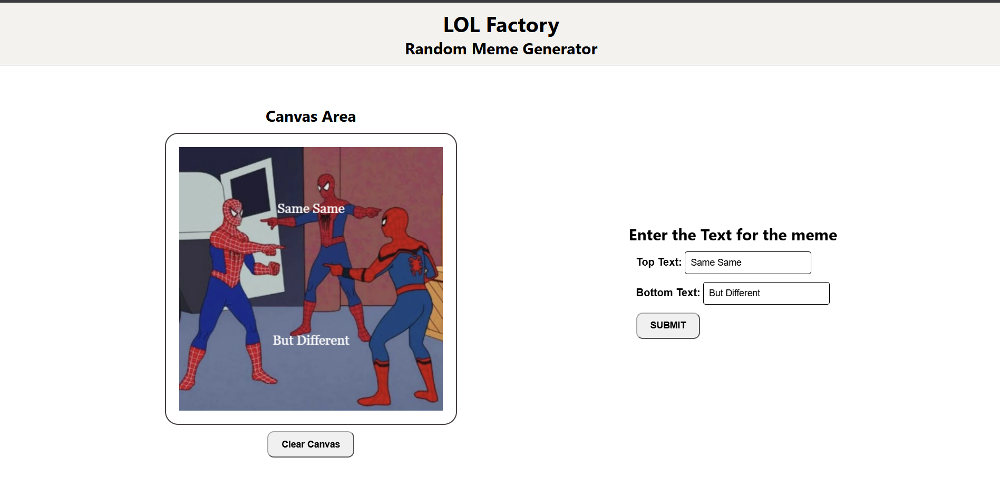

# Welcome to My Portfolio

## Introduction

Hello, I'm Aviral Umrao, a computer science student who enjoys building things with code and figuring out how technology can solve real problems. I spend most of my time exploring web development, working on personal projects, improving my problem-solving skills, and learning technologies that help me turn ideas into working products.

## Featured Work

### Project 1: LeetCode Analyser

- *Description:*  A web application that turns LeetCode profile data into useful insights, helping users understand their problem-solving activity, question difficulty, language usage, and overall coding progress.
- *GitHub Repository:* [Leetcode Analyser](https://github.com/aviralumrao/leetcode-analyser)

### Project 2: LOL Factory

- *Description:* An interactive web project built to experiment with creative frontend development, user interactions, and responsive layouts while keeping the experience simple and engaging.
- *GitHub Repository:* [LOL Factory](https://github.com/aviralumrao/LOL-Factory)

## Call to Action

I'm always interested in learning, building, and working on things that push me outside my comfort zone. Whether it's a project, collaboration, or an opportunity to learn something new, feel free to reach out:

- *Email:* aviral0419@gmail.com
- *LinkedIn:* [Aviral Umrao on LinkedIn](https://www.linkedin.com/in/aviralumrao)
- *GitHub:* [Aviral Umrao on GitHub](https://github.com/aviralumrao)

-------------------------------------------------

# About

## Personal Information

I'm Aviral Umrao, a computer science student who likes spending time building software, experimenting with ideas, and understanding how things work behind the scenes. Other than writing code, I also enjoy learning new concepts and challenging myself with problems that require logical thinking.

- *Full Name:* Aviral Umrao
- *Date of Birth:* September 29, 2006
- *Location:* Ghaziabad, UP

## Passions and Values

I enjoy building things that solve an actual problem. I do not work on projects just so I can add them to a portfolio. I build when I see a problem that needs a solution. I work with coding data, OCR and web applications. I take an idea. Figure out how to turn it into something that works.

I am particularly interested in web development and software engineering. I enjoy seeing how different parts of a system come together. I like working on the frontend. I also like understanding what happens in the backend.

I also value consistency and improvement. I like challenging myself to get better at development and problem-solving. I do this by learning a technology improving an existing project or tackling a hard programming problem.

## Unique Qualities

I am naturally competitive with myself. I push my work beyond the requirement. When something works I think about how it could be cleaner. I think about how it could be more efficient and better.

I learn quickly when I have a concrete goal in front of me. I have worked with technologies that were initially unfamiliar to me by breaking the problem down, researching what I needed, experimenting, and gradually putting everything together.

I am comfortable working under pressure. I figure things out as I go. Balancing college, projects, technical work and other opportunities can be challenging. It has taught me to adapt. I prioritize what matters. I keep moving when things do not go exactly as planned.

-------------------------------------------------

# Skills

## Technical Skills

### Web Development

- *Frontend:*
  - HTML
  - CSS
  - JavaScript
  - React
- *Backend:*
  - Node.js (learning)

### Database Management

### Version Control

- Git

### Tools & Technologies

- Responsive Web Design
- Figma
- VS Code
- Framer

## Certifications

- [*Claude Code in Action - Anthropic*](https://verify.skilljar.com/c/hz9fx6yoezy6)

## Languages

- *JavaScript*
- *HTML/CSS*
- *Java*